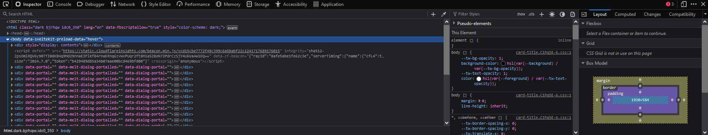
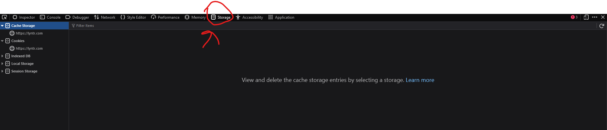
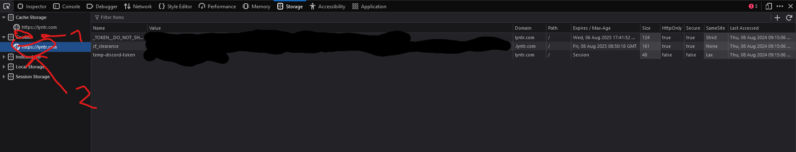

# lyntrpy
 A api wrapper for lyntr`s api in python

# How to make the .env file
In order to create a `.env` file you need 3 cookies:
- `_TOKEN_DO_NOT_SHARE`
- `temp-discord-token`
- `cf_clearance`

The `_TOKEN_DO_NOT_SHARE` cookie is required to authenticate with the lyntr api.

The `temp-discord-token` cookie is only needed when creating an account (to my knowledge) so it can probaly left empty but i would stil set it.

The `cf_clearance` is used to authenticate with cloudflare and use the api and not be blocked. This cookie is known for expirering quickly, for now the 
solution is to manualy copy the cookie from a browser and paste it it (i am working on an automatic system).

Now that we know what each cookie does, how to actually get them? (please note the tutorial for getting the cookies is for firefox)

Firstly navigate to [lyntr](https://lyntr.com) and press `Control+S+I`, you should be meet with this

Now navigate to the `Storage` tab

And click on `Cookies > https://lyntr.com`

Now copy the `_TOKEN_DO_NOT_SHARE` cookie to the file `.env` to a variable named `TOKEN`, the `temp-discord-token` cookie to `temp-discord-token` and the `cf_clearance` cookie to `cf_clearance`.

If you do all these steps correctly you should be able to start implementing the wrapper in your code.

Happy Codeing.

# ToDo
- [ ] Add photo support for lynting
- [ ] Add auto cloudflare cookies collector from browser to .env is not required